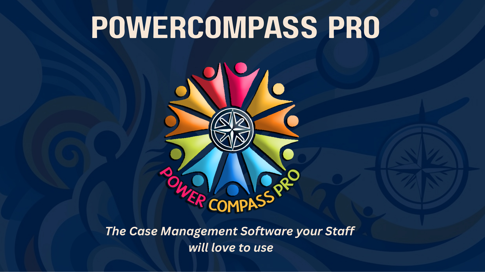
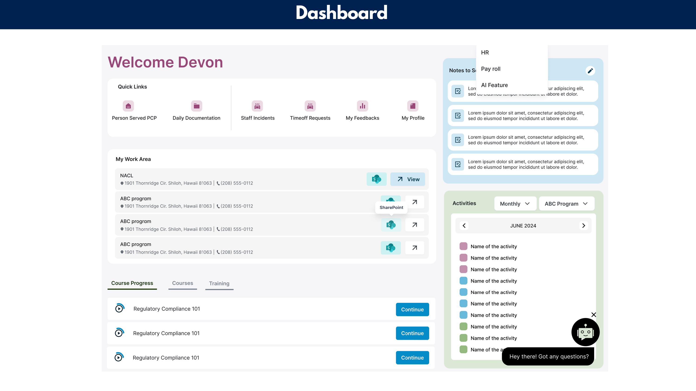
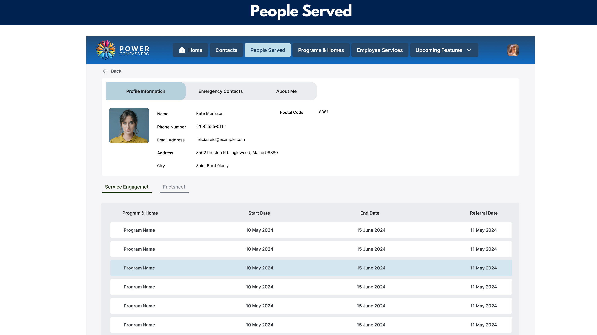
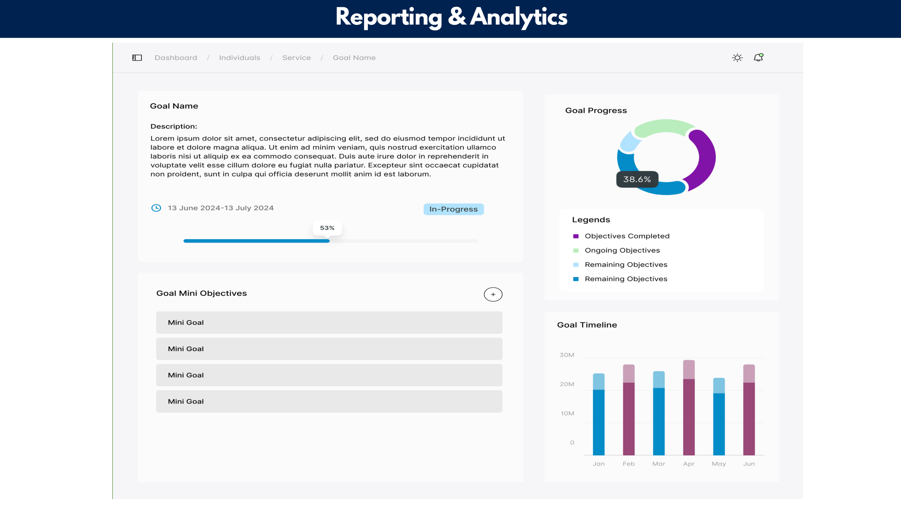
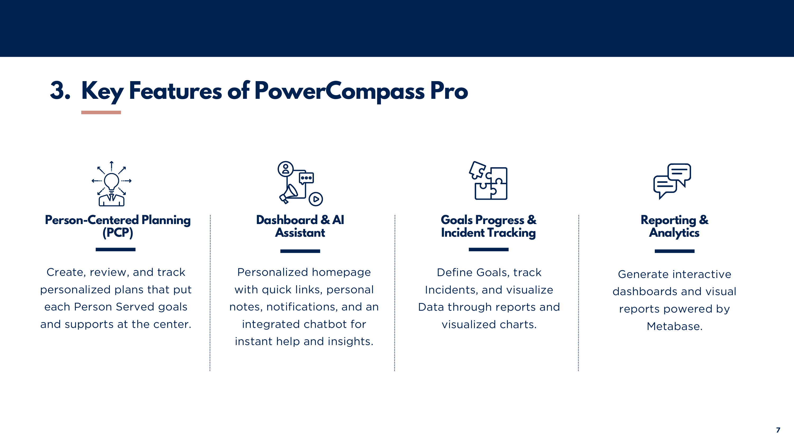
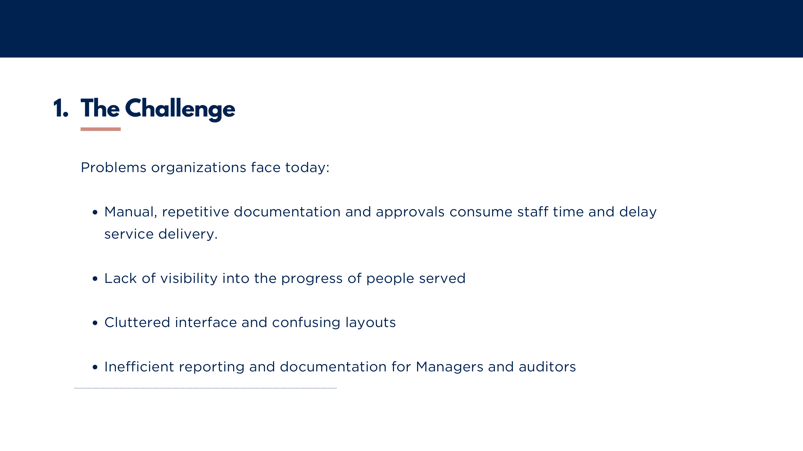

# PowerCompass Pro — Case Study

> Multi-tenant SaaS case management platform replacing Microsoft Power Apps for non-profit organizations serving individuals with developmental disabilities. Built as lead developer at Charvar Networks Canada.

[](https://powercompasspro.com)
[](https://powercompasspro.vercel.app/login)
[](https://nextjs.org/)
[](https://supabase.com/)
[](https://postgresql.org/)
[](https://stripe.com/)

---

## Demo

[](https://youtu.be/5j7n_2j5pmQ)

*Click to watch the full product walkthrough*

---

## The Problem

NACL — a multimillion-dollar non-profit supporting individuals with developmental disabilities — was running their entire operation on Microsoft Power Apps. The system had critical limitations:

- Manual, repetitive documentation consumed staff time and delayed service delivery
- No meaningful analytics for board-level operational decisions
- Cluttered interface creating friction for 300+ daily users
- Inefficient reporting workflows for managers and auditors

The proposal was made internally to replace the system entirely. It was approved. The build started from zero.

---

## Screenshots

| | |
|---|---|
|  |  |
| *PowerCompass Pro* | *Staff dashboard — quick links, work area, course progress, AI assistant, activity feed* |
|  |  |
| *People Served — profile, service engagement, program history* | *Reporting & Analytics — goal progress charts, goal timeline, mini objectives* |
|  |  |
| *Core feature set* | *The problem this replaced* |

---

## What Was Built

A full-stack multi-tenant SaaS platform designed to serve multiple non-profit organizations, each with 200+ employees — all from a single deployment with complete data isolation between tenants.

### Core Modules

**Staff Dashboard**
- Personalized homepage with quick links, personal notes, notification feed
- Work area showing assigned programs and homes
- Course progress tracker with training assignments
- Activity calendar filtered by program
- Integrated AI chatbot for instant help and insights

**People Served (Case Management)**
- Centralized profiles: personal info, emergency contacts, About Me
- Service engagement history — programs, start/end dates, referral tracking
- Documentation, goals, incidents, service details, and calendar per individual

**Person-Centered Planning (PCP)**
- Multi-step PCP builder: Like & Admire, Relationship Map, Communication Chart, Learning Log, and 13 additional structured sections
- Step progress tracking with flag-for-follow-up
- Review and approval flows for managers and admins

**Goals & Incident Tracking**
- Define goals with mini-objectives and timelines
- Visual progress charts (donut + bar) tracking objectives completed vs. ongoing vs. remaining
- Incident logging with structured fields

**Reporting & Analytics**
- Real-time dashboards powered by Metabase
- Board-level operational reports — eliminated manual reporting entirely
- Filterable by program, individual, date range

**Employee Services**
- Time-off requests
- Staff incident reporting
- My Feedbacks module
- My Profile management

**Integrations**
- Microsoft 365 Single Sign-On
- SharePoint integration
- Customizable modules per organization

---

## Technical Architecture

```
┌──────────────────────────────────────┐        ┌──────────────────────────────────────┐
│         Next.js Frontend             │  HTTPS │    Supabase Backend (PostgreSQL)     │
│         (Vercel)                     │◄──────►│                                      │
│                                      │  JWT   │  - Multi-tenant schema with RLS      │
│  - Staff Portal                      │        │  - Row-level security policies       │
│  - Admin Panel                       │        │  - Role-based auth                   │
│  - Person-Centered Planning flows    │        │  - Real-time subscriptions           │
│  - Reporting dashboards (Metabase)   │        │  - File storage                      │
│  - AI chatbot integration            │        │  - Migration infrastructure          │
└──────────────────────────────────────┘        └──────────────────────────────────────┘
                                                              │
                              ┌───────────────┬──────────────┼──────────────┐
                              │               │              │              │
                         ┌─────────┐   ┌──────────┐  ┌──────────┐  ┌──────────────┐
                         │ Stripe  │   │   Novu   │  │Metabase  │  │  MS365 SSO   │
                         │payments │   │  notify  │  │analytics │  │  SharePoint  │
                         └─────────┘   └──────────┘  └──────────┘  └──────────────┘
```

---

## Tech Stack

| Layer | Technology |
|---|---|
| Frontend | Next.js (React), TypeScript, Tailwind CSS |
| Backend | Supabase — PostgreSQL, RLS, Auth, Real-time, Storage |
| Analytics | Metabase (embedded dashboards) |
| Payments | Stripe with concurrency handling |
| Notifications | Novu |
| Auth | Supabase Auth + MS365 SSO |
| Testing | Playwright (automated test suite) |
| CI/CD | GitHub Actions |
| Hosting | Vercel (frontend) |
| Security | PostgreSQL RLS policies, role-based access, multi-tenant data isolation, end-to-end encryption |
| Compliance | Fully hosted in Canada — CARF standards compliant |

---

## Security & Multi-Tenancy

Every organization's data is completely isolated at the database level using PostgreSQL Row-Level Security (RLS) policies. No application-layer filtering alone — the database itself enforces that tenants cannot access each other's data under any circumstances.

- RLS policies on every table with tenant-scoped `SELECT`, `INSERT`, `UPDATE`, `DELETE`
- Role-based access control: frontline staff vs. managers vs. admins vs. board
- Stripe payment processing with concurrency handling to prevent race conditions
- Migration infrastructure for safe schema evolution across tenants

---

## Results

| Metric | Result |
|---|---|
| Stakeholder satisfaction | **95%** across employees and board |
| Manual reporting workflows eliminated | **100%** — board uses in-app analytics directly |
| Organizations served | Multiple, each with 200+ employees |
| Deployment | Launching July 2026 at [powercompasspro.com](https://powercompasspro.com) |

---

## My Role

Lead developer in a team of one developer, one project manager, and one designer.

- Proposed the project internally — made the business case, got buy-in
- Designed the full system architecture: database schema, multi-tenant RLS strategy, API design, frontend structure
- Built every layer of the stack: Next.js frontend, Supabase backend, all integrations
- Ran structured user testing rounds throughout development with employees and board members
- Iterated continuously based on feedback — 95% satisfaction through that loop
- Set up Playwright automated testing infrastructure and GitHub Actions CI/CD
- Leveraged AI-driven tooling to accelerate development and automate test generation
- Owned deployment, ongoing maintenance, and feature roadmap

---

## Beta Program

PowerCompass Pro is currently inviting select non-profit and community-living organizations to join the beta program.

👉 **[Try the beta](https://powercompasspro.vercel.app/login)**
👉 **[Visit powercompasspro.com](https://powercompasspro.com)**

---

## Related Projects

- **[Training Portal — Punjab Insurance](https://github.com/AbhayParasharhere/Training_Portal_PI)** — Full-stack broker training and client management platform (Next.js + Django REST Framework, AWS)
- **[Poster Maker — Punjab Insurance](https://github.com/AbhayParasharhere/Poster-maker-frontend)** — Branded social media poster generation portal (React + Django REST Framework)
